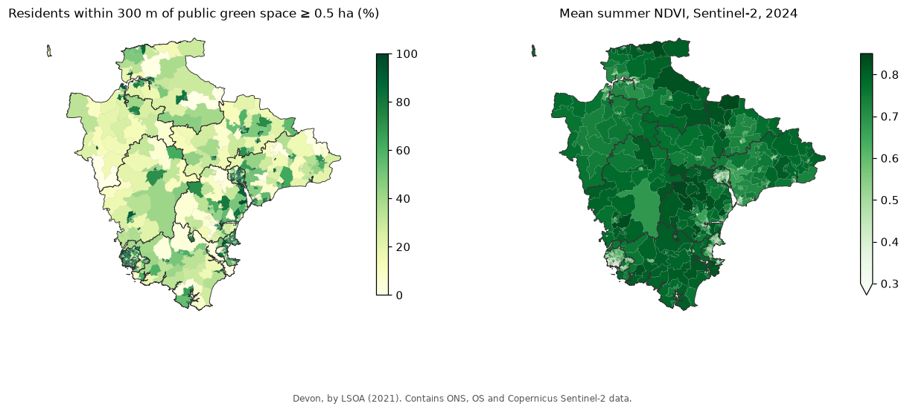
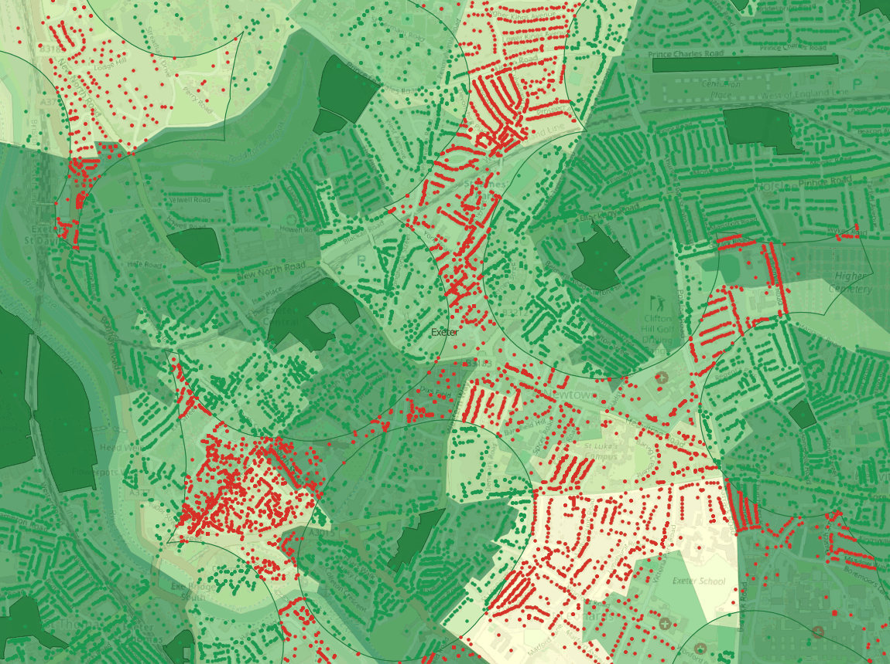
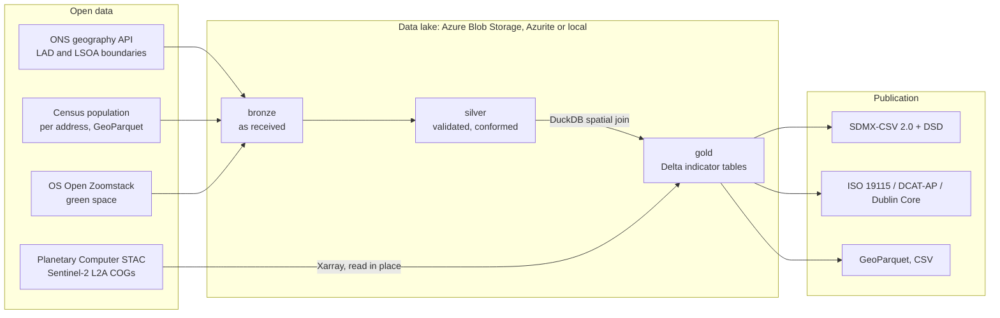

# Green space indicators for Devon: a geospatial lakehouse on Azure

Two environmental indicators for the ten local authorities of Devon and their 729
neighbourhoods (LSOAs), produced the way a statistics office would: from open data, in a cloud
data lake (run on Azure Data Lake Storage Gen2), published as **SDMX** statistics with **ISO 19115**, **DCAT-AP** and **Dublin Core**
metadata.

**[Live map](https://petersolan.github.io/GB-Green-Space-Indicators/)**: both indicators for all 729 LSOAs, with the green sites.

- **Green space access (GSA_300M):** share of residents within 300 m of a public green space of
  at least 0.5 ha, the WHO Europe benchmark. Population comes from census totals modelled per
  address (companion project [GB-Census-Population-Map](https://github.com/petersolan/GB-Census-Population-Map)).
- **Summer greenness (NDVI_MEAN, NDVI_VEG_PCT):** cloud-masked Sentinel-2 NDVI for summer 2024,
  read straight from **Microsoft Planetary Computer** with **Xarray**; NDVI_CLEAR_PCT reports
  each area's cloud-free coverage as a quality measure.



**Findings:** 59% of Devon's 1.2 million residents live within 300 m of qualifying green space.
The cities lead (Plymouth 73%, Exeter 70%) and rural districts trail (Torridge, West Devon 44%),
while greenness runs the other way: the greenest places have the fewest public parks.
Plain-language summary: [docs/findings.md](docs/findings.md). Options, risks and effort to take
this to production: [docs/feasibility.md](docs/feasibility.md).



*Central Exeter at street scale, from the QGIS project: every address is green if it is within
300 m of a public green space of at least 0.5 ha (dark green, with the reach outlined) and red if
not. The red pockets are the gaps the indicator counts. Basemap © OpenStreetMap contributors.*

## How it works



| Stage | What happens | Tools |
|---|---|---|
| `bronze` | Boundaries from the ONS API (POST queries, paged); the area's 882,000 addresses filtered on read from national GeoParquet; green space for the area's extent | httpx, PyArrow, GeoPandas |
| `silver` | Schema checks (unique addresses, valid GSS codes, addresses inside their district); LSOAs assigned to districts spatially; public green space parcels merged into sites, sites under 0.5 ha dropped | pandera, Shapely |
| `access` | Addresses within 300 m of a site via a spatial join in **DuckDB**; nearest-site distance; resident-weighted shares by LSOA and district | DuckDB spatial, GeoPandas |
| `ndvi` | Clearest 8 summer days found by STAC search, red/NIR/scene-classification bands opened lazily at 20 m on the British National Grid, cloud masked, median NDVI; zonal statistics | pystac-client, odc-stac, Xarray, Dask |
| `publish` | Tidy indicator table; SDMX structures and data (checked against their own codelists); metadata from one record (DCAT-AP validated against the official SHACL shapes) | sdmx1, pygeometa, rdflib, pySHACL |

Each stage reads from and writes to the lake, so stages rerun independently. Gold tables are
**Delta** (atomic writes, schema enforcement, time travel), readable by Databricks, Fabric and
Synapse as they are.

## Standards and interoperability

| File in [`publication/`](publication/) | Standard |
|---|---|
| `indicators.sdmx.csv` | **SDMX-CSV 2.0** observations (area, indicator, year, value, unit) for dataflow `DF_GREEN_SPACE` |
| `indicators.dsd.xml` | **SDMX-ML 2.1** structures: codelists (areas with each LSOA's district as parent, indicators, units), concepts, data structure definition, dataflow |
| `metadata.iso19139.xml` | **ISO 19115** metadata in ISO 19139 XML (the INSPIRE / UK GEMINI encoding) |
| `metadata.dcat-ap.jsonld` | **DCAT-AP 3** catalogue record, passes the official DCAT-AP 3.0.0 SHACL shapes |
| `metadata.dc.xml` | **Dublin Core** (OAI-DC) |
| `indicators.csv`, `indicators_lsoa.parquet` | Tidy CSV; LSOA polygons with all indicators as **GeoParquet** |

All three metadata records are generated from [`metadata/record.yml`](metadata/record.yml), so
they can't disagree. Areas use ONS GSS codes; geometry is British National Grid (EPSG:27700).

## Results by district

| District | Residents | Within 300 m | Median distance | Summer NDVI | Vegetated |
|---|---|---|---|---|---|
| Plymouth | 264,713 | 72.6% | 189 m | 0.57 | 58% |
| Exeter | 130,712 | 69.7% | 201 m | 0.61 | 65% |
| Torbay | 139,314 | 66.1% | 219 m | 0.66 | 71% |
| East Devon | 150,827 | 52.0% | 284 m | 0.75 | 89% |
| Mid Devon | 82,834 | 51.9% | 285 m | 0.77 | 90% |
| Teignbridge | 134,793 | 51.6% | 288 m | 0.79 | 92% |
| North Devon | 98,616 | 51.1% | 291 m | 0.78 | 93% |
| South Hams | 88,625 | 46.8% | 325 m | 0.79 | 91% |
| West Devon | 57,090 | 43.8% | 348 m | 0.77 | 94% |
| Torridge | 68,108 | 43.6% | 356 m | 0.76 | 94% |

Median distance is to the nearest qualifying site, for residents. Green space: 1,374 sites of
at least 0.5 ha (48.5 km²). Sentinel-2: 31 scenes on the 8 clearest days of June to August
2024, 96–100% clear coverage per district.

**Limitations:** straight-line distances (walking routes are longer); formal public green space
only (countryside, footpaths and beaches aren't counted, which understates rural access); one
summer of imagery. Each is discussed, with options, in the [feasibility note](docs/feasibility.md).

## Running it

```bash
conda env create -f environment.yml
conda activate greenidx
pip install --no-deps -e .
python -m greenidx all          # bronze, silver, access, ndvi, publish (about 2 minutes)
python -m greenidx ls           # list the lake
pytest                          # synthetic-data tests (+ Azurite if running)
python docs/make_map.py         # redraw the map
python qgis/export_view.py      # outputs/view.gpkg for QGIS
python scripts/export_site.py   # site/data/*.geojson for the live map (GitHub Pages)
# then, with QGIS's Python: qgis/build_project.py -> outputs/green_space.qgz (styled
# project: indicators, green space, every address) and qgis/render_image.py
```

The lake backend comes from the environment or a `.env` file (copy `.env.example`; values
already set in the environment take precedence):

| `LAKE_BACKEND` | Where the lake lives |
|---|---|
| `local` (default) | `./lake` |
| `azurite` | Azure Storage emulator: `docker compose up -d azurite` |
| `azure` | A real storage account: set `AZURE_STORAGE_CONNECTION_STRING` (or account name and key) |

The same code runs on all three; CI runs the tests against both a local lake and Azurite.

**On Azure:** with the [Azure CLI](https://learn.microsoft.com/cli/azure/install-azure-cli) and
`az login`, `.\scripts\azure_setup.ps1` creates a resource group, an ADLS Gen2 storage account
(HTTPS only, TLS 1.2, no public access) and the `lake` container, and writes the connection to
`.env`. Then `python -m greenidx all` builds the lake in Azure. `.\scripts\azure_setup.ps1
-Teardown` deletes it all again. For production, the account key would give way to Microsoft
Entra ID sign-in and Key Vault (see the [feasibility note](docs/feasibility.md)).

This has been run on a real Azure subscription: an ADLS Gen2 account in UK South held the whole
lake (23 files, 220 MB across bronze, silver and gold), the full pipeline took about 1.5
minutes from a laptop, and the indicators matched the local run exactly. Storage at that size
costs well under a penny a month. On a new subscription the script first registers the
`Microsoft.Storage` resource provider, which Azure otherwise reports as a misleading
"SubscriptionNotFound".

Inputs not fetched from the internet are read from the companion projects: the census outputs
(`CENSUS_DIR`) and OS Open Zoomstack (`ZOOMSTACK_GPKG`).

## Repository layout

```
src/greenidx/
  config.py        area, indicator definitions, sources
  lake.py          bronze/silver/gold on local, Azurite or Azure Blob (GeoParquet, Delta)
  bronze.py        fetch and filter sources
  silver.py        validate and conform (pandera)
  gold_access.py   green space access (DuckDB spatial)
  gold_ndvi.py     Sentinel-2 greenness (STAC, Xarray)
  publish.py       indicator table, SDMX, ISO 19115 / DCAT-AP / Dublin Core
metadata/record.yml   the one metadata record
publication/          the published outputs
docs/                 findings, feasibility note, map
qgis/                 export for viewing, QGIS project builder, image renderer
tests/                synthetic-data tests
scripts/azure_setup.ps1  create (or delete) the Azure storage and point .env at it
scripts/export_site.py   GeoJSON for the live map
site/                    the live map (MapLibre), deployed to GitHub Pages
```

## Data and licences

| Data | Source | Licence |
|---|---|---|
| LAD (May 2025) and LSOA (2021) boundaries | ONS Open Geography Portal | OGL v3 |
| Population per address | GB-Census-Population-Map (Census 2021, ONS UPRN Directory, OS Open Zoomstack buildings) | OGL v3 |
| Green space | OS Open Zoomstack | OGL v3 |
| Sentinel-2 L2A | Copernicus, via Microsoft Planetary Computer | Copernicus Sentinel data licence |
| Basemap in the images and QGIS project | OpenStreetMap | ODbL |

Contains OS data © Crown copyright and database right 2026. Source: Office for National
Statistics, licensed under the Open Government Licence v3.0. Contains modified Copernicus
Sentinel data 2024.

Code: [MIT](LICENSE).
